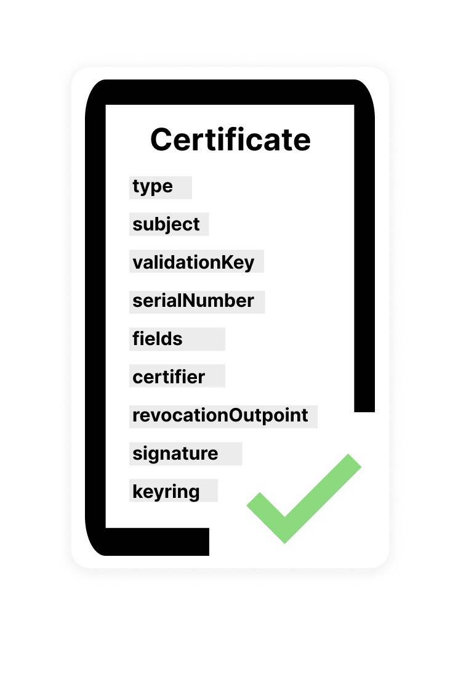

# BRC-52: Certificates

Brayden Langley (brayden@projectbabbage.com)

## Abstract
Identity on the internet has come to rely almost exclusively on trusted third parties acting as gatekeepers for user authentication. Digital signatures provide part of the solution, but there is still a need to link the public key with the true identity of the signer, while still tolerating key compromises. We define an open-ended, ubiquitous and privacy-centric version of digital identity certificates that facilitate selective revelation and UTXO-based revocation. BRC-3 digital signatures ensure the authenticity of certified fields, while BRC-2 encryption facilitates an approval-based access control scheme. In this standard, we define the data structures, key derivation protocols, signing and verification procedures for identity certificates. We also discuss how responsible certificate issuers can handle key compromises.

## Motivation
The motivation behind this standard is to address the limitations of digital signatures for verifying the true identity of internet users, a verification process which currently relies heavily on passwords and trusted third parties. 

The goal is to create an open-ended, privacy-centric, and ubiquitous solution for digital identity certificates that facilitates selective revelation and UTXO-based revocation. This standard aims to provide a decentralized and reliable method for identity verification without compromising user privacy, and could be useful in various scenarios, including e-commerce, financial transactions, and secure communication. 

By providing a secure method for linking a user's public key to their true identity, the standard would enable secure and private online transactions and collaborations, while also protecting against fraudulent activities and identity theft. By recognizing that key compromises do occur and supporting certificate revocation, we allow users to recover from breaches without tying their entire digital identity to a single key.

## Specification
We start by specifying the data structures needed to represent various components of identity certificates, then proceed to key derivation schemes, signing and verification procedures, the secure verifier field revelation protocol, and finally UTXO-based revocation and responsible key compromise handling procedures.

### Data Structures
 
**PublicKey**
 
The PublicKey structure is a compressed, DER-encoded secp256k1 public key (only the X coordinate), formatted as a 33-byte hexadecimal string.
 
*Example:*
 
`02e087b19a205ae13f512341d1cfc0c712d66cacad24a809fce7edb3529e78b5da`
 
**Nonce**
 
The Nonce structure is a 256-bit number, converted to a base64 string.
 
*Exampl:e*
 
`L9t1aQLkWkmMw1Poi1ofIjHV6GO+BNN63v8Na8/gW4Y=`
 
 
**Signature**
 
The Signature structure is a DER-encoded ECDSA signature converted into a hexadecimal string.
 
Example
 
`3045022100c0686907d8914abfa7f356c560c7d17045dde5c10135b1cbf9bf6e4cc52e09820220366eec15372bc34db10f997e21755f603a2023c96578e9d71fca2570f23055d6`
 
 
**RevocationOutpoint**
 
The Outpoint structure is a Bitcoin SV TXID (a hexadecimal string) and output index (a decimal integer), separated by a decimal point (“.”). When a certificate outpoint has been spent, the certificate has been revoked.
 
Example
 
`48645047cd66f7b48b24efb080ec7e27f3f448c21109939b80afd11e40898c92.1`
 
 
**CertificateTypeID**
 
The CertificateTypeID structure is a 256-bit number that represents the distinct type or class of certificate issued by the certifier, converted to a base64 string. All certificate types with the same unique Type ID can be expected to have the same fields, and fields can be expected to have the same meanings.
 
Example
 
8l5phhdm2Hi80s6QqFOLS0NwUzDzJhlUTWv2BezmstE=
 
 
**CertificateValidationKey**
 
The CertificateValidationKey structure is a 256-bit key converted to a base64 string. The key is used by verifiers to check the signature on the certificate.
 
Example
 
G4pBfpBEZ7n5iEHrtG5MFOnIO0U1D758naHJilcK/RU=/7lzk4XTKI=+BNN63v8Na8/gW4Y=
 
 
 
**CertificateSerialNumber**
 
The CertificateSerialNumber structure is a 128-bit number that represents the unique identifier of the certificate, converted to a base64 string. No two certificates should have the same serial number, especially certificates from the same certifier or of the same type.
 
Example
 
kUahacBHmYL2nkzemkatFg==
 
 
**CertificateFieldValue**
 
The CertificateFieldValue structure is a piece of certified information that is encrypted with one of the CertificateFieldRevelationKeys. The 256-bit initialization vector used is prepended to the beginning of the data, and the AES-256-GCM algorithm is used. The structure is represented as a base64 string.
 
Example
 
IlgngMNcUM0d4GyzkSGqXaIBw6/n8bB6BG0pprO6oGhxUcivP6wDfuMWjWrG64KQJYUMN3QjHoX40r3SvAyWQaAA9ldVuPLgZwi9q2TCECKHCyEuiATCM9PdB/Ba2rxp
 
 
**CertificateFieldRevelationKey**
 
The CertificateFieldRevelationKey structure is a 256-bit AES-GCM encryption key used to decrypt and reveal one of the CertificateFieldValues. It is represented as a base64 string.
 
Example
 
ZG3C7x11lIeqd5Fi9BDzeTXMEAIlh+uDOB53d03EV5s=
 
 
**CertificateFields**
 
The CertificateFields structure is an object whose keys are certificate field names, and whose values are CertificateFieldValue structures.
 
*Example*
 
```json
{
  “first_name”: “IlgngMNcUM0d4GyzkSGqXaIBw6/n8bB6BG0pprO6oGhxUcivP6wDfuMWjWrG64KQJYUMN3QjHoX40r3SvAyWQaAA9ldVuPLgZwi9q2TCECKHCyEuiATCM9PdB/Ba2rxp”,
  “last_name”: “3o0jTew8WMW54svE8Btx9Aks1FlQCHOxGKLZpc7SR0ESSIomToAYFtCq6U7NUuf3ktwLgnv5XdCrCTo+mOTHl/H+oyjcxB7xfdwav+bBx6vG5y9voDI/Z2MQGxE/Pmeg”,
  “address_line_1”: “WGqZGJo7VHeQ5tx7uqeyA5q08tRVxJLUoprjAiJ8FmzOoe4gt0+6PGDgvrhkbzauSxGY9yRyOeP+irHclCIrzjwjbfkK19thoyUhr8u1283FobikPs2xKrhUvcYhDOV7”,
  “address_line_2”: “IjI5UXJnMbcSEqIVkH8B5a9cY8EtWO7RvJH9gAWuIq0Y3koINgfqNjmockAgXnGxLvdQXvWdlCIm+foedIdHhqs9Xi60wR7hLSs9emjo6nq1Mx01wYFRW1le//Sup80x”,
  “city”: “Ed4Nr8UL3h7AqX3PlExwLQ0Mi/QLBH9wCIpdeMb442HDbQlodF1eUuJQRXt+0ajzmXEqaGNSD59xEXmsFouLDLa6sOOzXr2psCKMXkU1+IFHGv8TgJx/vDTCxMvL7t2T”,
  “state”: “6oiC8AMFFrLRGhpbWUO1HkA05/QPmfaUg1be4cP2vbcadIv4quaBgfwmNWE6xItpQNAfEwrx1ub9b4cNIKnN+6JAsiDiqs42mbjsgTuZL90fSEL9yPTwRuvW1ccvJ43z”,
  “zipcode”: “Y+iqr8cSMEMMq8WqpIudzni1DIiQT5BsK29ld8lFCZddrrjep0qQyKoaP9+46ikIu9VOQIoOJayhiW7KifUSYt+D/WODyPei4Ru7tqfgR47Vo4u0EFI3KLBXyC3DgiN+”
}
```
 
### CertificateFieldRevelationKeyring
 
The CertificateFieldRevelationKeyring structure is an object whose keys are certificate field names and whose values are encrypted versions of the corresponding CertificateFieldRevelationKeys that decrypt them.
 
When a sender is communicating with a counterparty over a communications channel, the sender encrypts the field revelation keys with an ECDH shared secret so that only the counterparty can decrypt the field decryption keys, decrypt the field values and perform their validation. Each CertificateFieldRevelationKey is encrypted with AES-256-GCM, and the 256-bit initialization vector is prepended to the ciphertext.
 
The sender follows these steps to derive the shared secret with which they encrypt the CertificateFieldRevelationKey:
 
**1. Derive their private key:**
 
derivePrivateKey(senderPriv, counterpartyPub, “2-authrite certificate field encryption xxxxx-yyyyy zzzzz”)
 
**2. Derive the counterparty’s public key:**
 
derivePublicKey(senderPriv, counterpartyPub, “2-authrite certificate field encryption xxxxx-yyyyy zzzzz”)
 
Use the shared secret between the keys from step 1 and step 2 for encryption.
 
The counterparty follows these steps to derive the shared secret with which they decrypt the CertificateFieldRevelationKey:
 
**3. Derive their private key:**
 
derivePrivateKey(counterpartyPriv, senderPub, “2-authrite certificate field encryption xxxxx-yyyyy zzzzz”)
 
**4. Derive the sender’s public key:**
 
derivePublicKey(counterpartyPriv, senderPub, “2-authrite certificate field encryption xxxxx-yyyyy zzzzz”)
 
Use the shared secret between the keys from step 1 and step 2 for decryption.
 
Where:
xxxxx is the certificate type ID
yyyyy is the certificate Serial Number
zzzzz is the field name which the CertificateFieldRevelationKey decrypts
 
**NOTE:** The bearer of a certificate is not obligated to reveal the keys to all certificate fields at all times to all parties. Therefore, a Certificate structure that contains an incomplete CertificateFieldRevelationKeyring (lacking keys for certain fields) can still be considered valid. It is up to the verifier how much information they need to examine.
 
*Example*

```json 
{
  “first_name”: “G2GmxIWNPkO2SUP0XpQvQqX31yz58aLHk9e7JxO+q/MT3k9ZjTe3t8aN2Qwg2+AtBulXZpKhuvxOgxicfd8GqCjFkGtyUrbSdmCFjPUJm7z/P/LWkJHByeBzh3/yOWa7”,
  “last_name”: “YZAHgs+P8Tgci3+5uuAuHr0k3CXPEcB3trpqtEUygV+uwoTgDWk01XTT1eOW6n7qjcDt4g7tlzuWtkawDkvRbCcVe3oBsEI5X8+A10s8TAsyNQV5O1R8mkGoL8/Hec4K”
}
```
 
### Certificate


 
The Certificate structure is an object with the following JSON fields:

Field         | Description
---------| ------------------------------------------
`type` | A CertificateTypeID structure indicating the type of certificate.
`subject` | A PublicKey structure denoting the key belonging to the party being certified.
`validationKey` | A CertificateValidationKey structure representing the validation key of the certificate.
`serialNumber` | A CertificateSerialNumber structure representing the unique serial number of the certificate.
`fields` | A CertificateFields structure containing all of the encrypted fields that were certified by the certifier.
`certifier` | A PublicKey structure denoting the well-known public key of the entity issuing the certificate.
`revocationOutpoint` | A RevocationOutpoint structure pointing to a Bitcoin SV UTXO. If the UTXO has been spent by the certifier, the certificate should be considered revoked. If all zeroes, this functionality is disabled for the certificate. Disabling UTXO-based revocation should be in accordance with the rules defining this certificate type.
`signature` | A Signature structure denoting the signature made by the certifying entity over the certified fields of the subject.
`keyring` | A CertificateRevelationKeyring structure containing keys for some or all of the fields of the certificate. If no fields are being revealed, this is optional.
 
*Example*
```json
{
  “type”: ”8l5phhdm2Hi80s6QqFOLS0NwUzDzJhlUTWv2BezmstE=”,
  “subject”: ”0376d67c86b45be3c36c328c2aa5c5dd79c546d22859e39439bd5d934058345abc”,
  “validationKey”: ”G4pBfpBEZ7n5iEHrtG5MFOnIO0U1D758naHJilcK/RU=/7lzk4XTKI=+BNN63v8Na8/gW4Y=”,
  “serialNumber”: ”kUahacBHmYL2nkzemkatFg==”,
  “fields”: {
    “first_name”: “IlgngMNcUM0d4GyzkSGqXaIBw6/n8bB6BG0pprO6oGhxUcivP6wDfuMWjWrG64KQJYUMN3QjHoX40r3SvAyWQaAA9ldVuPLgZwi9q2TCECKHCyEuiATCM9PdB/Ba2rxp”,
    “last_name”: “3o0jTew8WMW54svE8Btx9Aks1FlQCHOxGKLZpc7SR0ESSIomToAYFtCq6U7NUuf3ktwLgnv5XdCrCTo+mOTHl/H+oyjcxB7xfdwav+bBx6vG5y9voDI/Z2MQGxE/Pmeg”,
    “address_line_1”: “WGqZGJo7VHeQ5tx7uqeyA5q08tRVxJLUoprjAiJ8FmzOoe4gt0+6PGDgvrhkbzauSxGY9yRyOeP+irHclCIrzjwjbfkK19thoyUhr8u1283FobikPs2xKrhUvcYhDOV7”,
    “address_line_2”: “IjI5UXJnMbcSEqIVkH8B5a9cY8EtWO7RvJH9gAWuIq0Y3koINgfqNjmockAgXnGxLvdQXvWdlCIm+foedIdHhqs9Xi60wR7hLSs9emjo6nq1Mx01wYFRW1le//Sup80x”,
    “city”: “Ed4Nr8UL3h7AqX3PlExwLQ0Mi/QLBH9wCIpdeMb442HDbQlodF1eUuJQRXt+0ajzmXEqaGNSD59xEXmsFouLDLa6sOOzXr2psCKMXkU1+IFHGv8TgJx/vDTCxMvL7t2T”,
    “state”: “6oiC8AMFFrLRGhpbWUO1HkA05/QPmfaUg1be4cP2vbcadIv4quaBgfwmNWE6xItpQNAfEwrx1ub9b4cNIKnN+6JAsiDiqs42mbjsgTuZL90fSEL9yPTwRuvW1ccvJ43z”,
    “zipcode”: “Y+iqr8cSMEMMq8WqpIudzni1DIiQT5BsK29ld8lFCZddrrjep0qQyKoaP9+46ikIu9VOQIoOJayhiW7KifUSYt+D/WODyPei4Ru7tqfgR47Vo4u0EFI3KLBXyC3DgiN+”
  },
  “certifier”: ”035ce8cc44dbcf4c991d666d381d67263aed9123f9b15cca215b54f1314152d23c”,
  “revocationOutpoint”: “48645047cd66f7b48b24efb080ec7e27f3f448c21109939b80afd11e40898c92.1”,
  “signature”: “3045022100c0686907d8914abfa7f356c560c7d17045dde5c10135b1cbf9bf6e4cc52e09820220366eec15372bc34db10f997e21755f603a2023c96578e9d71fca2570f23055d6”,
  “keyring”: {
    “first_name”: “G2GmxIWNPkO2SUP0XpQvQqX31yz58aLHk9e7JxO+q/MT3k9ZjTe3t8aN2Qwg2+AtBulXZpKhuvxOgxicfd8GqCjFkGtyUrbSdmCFjPUJm7z/P/LWkJHByeBzh3/yOWa7”,
    “last_name”: “YZAHgs+P8Tgci3+5uuAuHr0k3CXPEcB3trpqtEUygV+uwoTgDWk01XTT1eOW6n7qjcDt4g7tlzuWtkawDkvRbCcVe3oBsEI5X8+A10s8TAsyNQV5O1R8mkGoL8/Hec4K”
  }
}
```
 
### Key Derivation Scheme

TODO

### Signing and Verification

TODO

### Secure Verifier Field Revelation Protocol

TODO

### UTXO-based Certificate Revocation

TODO

### Handling Key Compromises Responsibly

TODO

## Implementations

To implement this specification...

TODO: mention Authrite certificates and MYAC for creating your own certifier.

TODO: Maybe an example use-cases section would be good as well?