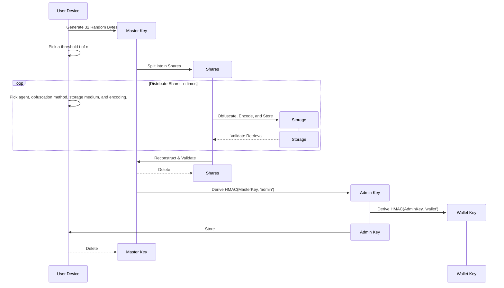

# BRC-81: Secure Custody and Recovery Scheme
## Abstract

We present a secure custody scheme for use across ecosystem wallets – with recovery paths defined separately for both individuals and enterprises.​

## Pain Point

A lack of clear guidance on how best to securely maintain control over BSV or any tokens digital assets as a serious business.

## Methodology

We formed a working group with wallet providers to share their own methods, discuss and compare technical approaches and user experience, and ultimately come to agreement on a standard.​

## Solution

By establishing an industry standard method for secure custody, we can enhance confidence, reduce the risk of theft or fraud, and streamline the user experience. Ultimately, we believe this will foster adoption of BSV Blockchain.​

This document is an attempt to formalize the scheme proposed during the workshop, which was given unanimous assent from participants and leadership.

## Overview

The idea combines a basic Shamir Secret Sharing Scheme for individual key holders with a modern Optimal Threshold Scheme, and uses Multi Party Computation of BRC-42 style linked keys, as well as locking scripts with multiple spend paths for disaster recovery.

We start with a single Master Key, this is split into multiple shares N and a threshold T is set such that T of N shares will recover the Master Key.

### Lagrange Interpolation
This is the Lagrange Interpolating equation which gives us a line which passes through a series of points on a field.
$$P\left(x\right)=\sum_{i=1}^{m}\left(y_{1}\left[i\right]\left(\prod_{j=1}^{i-1}\frac{\left(x-x_{1}\left[j\right]\right)}{x_{1}\left[i\right]-x_{1}\left[j\right]}\right)\left(\prod_{k=i+1}^{m}\frac{\left(x-x_{1}\left[k\right]\right)}{x_{1}\left[i\right]-x_{1}\left[k\right]}\right)\right)$$

No matter where these points are, the line will always join them smoothly. Now if we consider the Master Key as being some big number, we use this to set the y value of `x1` which always has an x value of 0. 

Points `x2`, `x3`, and `x4` are chosen at random to define a polynomial which runs through each point. The 4 points mean we have a thresold of 4. That can be any positive integer >= 2.

## Individuals

The specific user experience is somewhat flexible in terms of how the 

## SMOLDER

Shamir secret sharing  
Multi party computation  
Optimized threshold
Linked
Derivation   
Ecdsa  
Recovery  ​

## Implementation