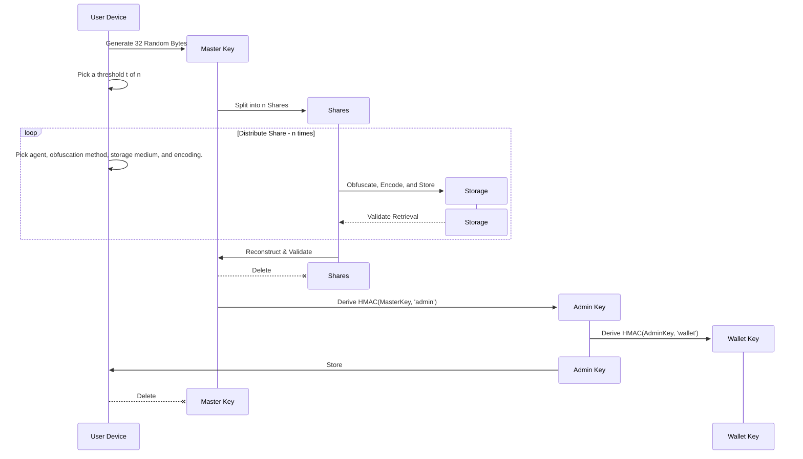

# BRC-81: SMOLDER: A Secure Custody and Recovery Scheme
## Abstract

We present a secure custody scheme for use across ecosystem wallets – with recovery paths defined separately for both individuals and enterprises.​

## SMOLDER

Shamir secret sharing  
Multi party computation  
Optimized threshold
Linked
Derivation   
Ecdsa  
Recovery  ​

## Pain Point

A lack of clear guidance on how best to securely maintain control over BSV or any tokens digital assets as a serious business.

## Methodology

We formed a working group with wallet providers to share their own methods, discuss and compare technical approaches and user experience, and ultimately come to agreement on a standard.​

## Solution

By establishing an industry standard method for secure custody, we can enhance confidence, reduce the risk of theft or fraud, and streamline the user experience. Ultimately, we believe this will foster adoption of BSV Blockchain.​

This document is an attempt to formalize the scheme proposed during the workshop, which was given unanimous assent from participants and leadership.

## Overview

The idea combines a basic Shamir Secret Sharing Scheme for individual key holders with a modern Optimal Threshold Scheme, and uses Multi Party Computation of BRC-42 style linked keys, as well as locking scripts with multiple spend paths for disaster recovery.

We start with a single Master Key, this is split into multiple shares N and a threshold T is set such that T of N shares will recover the Master Key.

### Shamir Secret Sharing Scheme
Allows us to split a single key into as many shares as we like. This is the Lagrange Interpolating equation which gives us a line which passes through a series of points on a field.
$$P\left(x\right)=\sum_{i=1}^{m}\left(y_{1}\left[i\right]\left(\prod_{j=1}^{i-1}\frac{\left(x-x_{1}\left[j\right]\right)}{x_{1}\left[i\right]-x_{1}\left[j\right]}\right)\left(\prod_{k=i+1}^{m}\frac{\left(x-x_{1}\left[k\right]\right)}{x_{1}\left[i\right]-x_{1}\left[k\right]}\right)\right)$$

No matter where these points are, the line will always run through each point smoothly. Now if we consider the Master Key as being some big number, we use this to set the y value of the point `x1` which is defined at x = 0. In the example above, y = 2 or in other words the Master Key is 2. 

Points `x2`, `x3`, and `x4` are chosen with random x and y values such that the order of the polynomial which runs through all of them is one less than the threshold of points required to rebuild it. We generate 3 additional points because we want 4 total for a thresold of 4 in the above example.

### Splitting

Now we take that Polynomial and punch in some random x co-ordinates such that we 5 points which are each still on that same curve as shown below.

These 5 points become our shares. We can have as many shares as we like, just by adding more points on this curve. Any 4 will result in our polynomial, which allows us to calculate the value at x = 0, which reveals our Master Key = 2.

You can see if we remove two points, we have lost the original Polynomial are no longer intersecting at 2.

You can play around with the [Lagrange Interpolating equation](https://www.desmos.com/calculator/l2unwgysy4) to better familiarize yourself with the concept.

## Individuals

We encourage individuals who interact within this scheme to construct a Master Key, and 

The specific user experience is somewhat flexible in terms of how the shares are stored, for simplicity this is abstracted away in the diagram below.

## Flexibility

There are many possibilities for users to keep the shares safe. For each share they could select a different combination:

| Decision | Choices |
|----------|---------|
| Agent | Self, Friend, Professional, Corporation, Government |
| Storage | Mobile, On Prem, Physical, Cloud, Air-Gapped Device |
| Obfuscation |	AES-GCM, XOR, Plaintext, Custom Algo |
| Encoding | Hex / Bytes, Base58Check, Mnemonic, QR |

## Sensible Defaults

A threshold 2 of 3 is a sensible default for splitting shares. With the following configuration:

| Agent | Storage | Obfuscation | Encoding |
|-------|---------|-------------|----------|
| Self  | Cloud | XOR | Bytes |
| Self  | Physical | Plaintext | QR |
| Professional | Physical | Plaintext | QR |

## Implementation