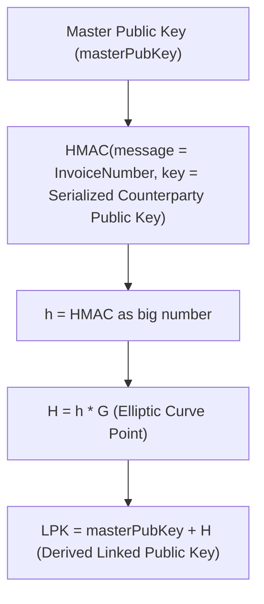
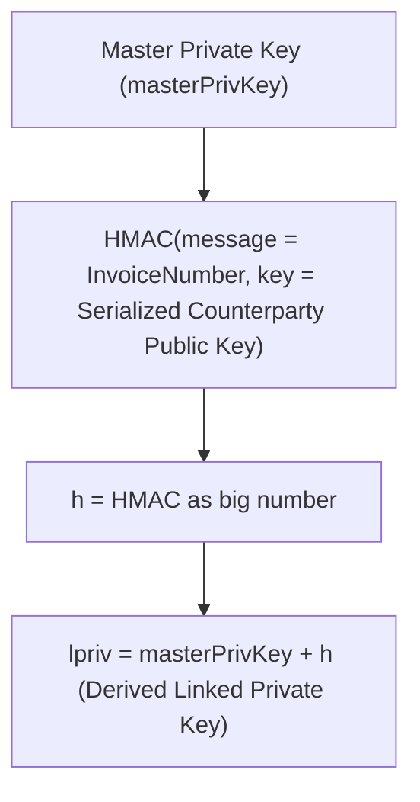

# BRC-84: Linked Key Derivation Scheme

Damian Orzepowski (damian.orzepowski@4chain.studio)

### Abstract
The Linked Key Derivation Scheme builds on and extends the "type 42" key derivation method. This scheme allows public key derivation using only the public keys of both parties, maintaining the flexibility and unlimited key derivation of type 42. It aims to enable non-custodial wallets to derive public keys from a master public key without private key access, while only the master private key owner can derive the corresponding private key.

### Motivation
The primary goal of this scheme is to enhance privacy and scalability in key derivation processes, enabling public key derivation based solely on the public keys of involved parties. Additionally, it ensures that the derived keys are linked back to their master keys, providing a mechanism for auditing and confirming the parties involved in transactions. This supports applications such as non-custodial wallets, ensuring secure and verifiable transactions without the need for private key access during the derivation process.

### Identity Keys
The assumptions regarding identity keys remain unchanged from type 42. Each party has a master key pair, where the master public key is used to derive linked public keys. This ensures that the derived keys are linked back to the master key without requiring the master private key during the public key derivation process.

### Security Considerations
The Linked Key Derivation Scheme maintains similar security properties to type 42, with the notable exception that no shared secret is generated or utilized. The scheme ensures that only the owner of the master private key can derive the corresponding linked private key, while public key derivation remains secure and private.

### Key Derivation Process

#### Public Key Derivation:

1. Generate HMAC from the invoice number using the serialized public key as the key.
2. Convert the HMAC to a scalar using big-endian encoding.
3. Multiply the generator point \( G \) by this scalar to obtain a point on the elliptic curve.
4. Add this point to the master public key (also expressed as a point) to get a new point on the elliptic curve.
5. This new point represents the derived linked child public key.

#### Private Key Derivation:

1. Generate HMAC from the invoice number using the serialized public key as the key.
2. Convert the HMAC to a scalar using big-endian encoding.
3. Add this scalar to the master private key (expressed as a number).
4. This resulting number is the derived linked child private key.

### Conclusion
The Linked Key Derivation Scheme provides a robust method for public key derivation, suitable for applications like non-custodial wallets, ensuring privacy, auditability, and secure key management without compromising security.
