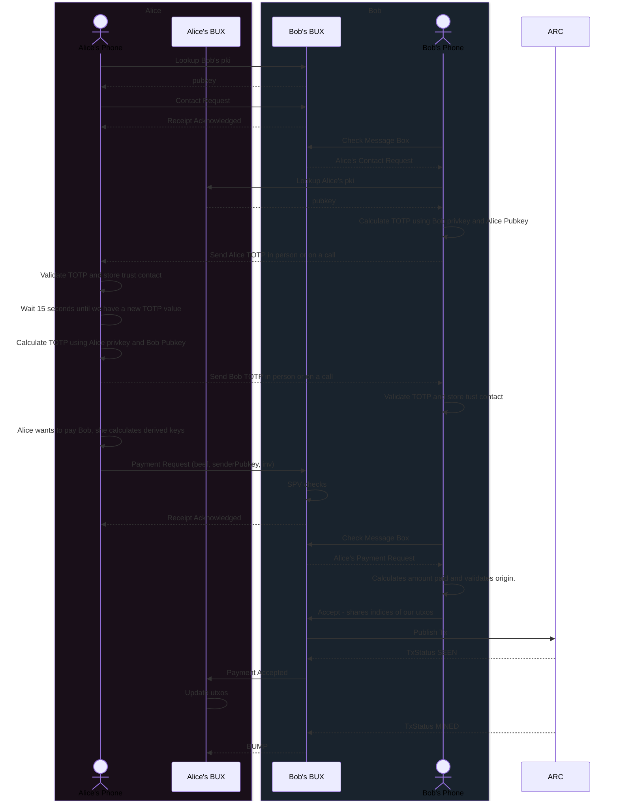

# BRC-80 - Solicited & Unsolicted Payment Flows with Mutual Auth

Deggen (d.kellenschwiler@bsvblockchain.org)

## Abstract

Thinking about how to avoid paying to outputs which an attacker has created, when communicating with a counterparty via hosted service discovery mechanisms. Ensuring we are able to determine counterparties in payments where the counterparties both sign off, and also when a pre-validation has occurred such that no further authorization is necessary from the receiving side.

## Motivation

Paymail p2p destinations and receive-rawtx are used today and there remains a security and privacy issue. For now it’s not proven that the outputs received are correct, and linked to the payee. It’s also not specified whether overpayment is allowed and so forth.

## Specification

Let’s see if we can define the flow in a diagram.

