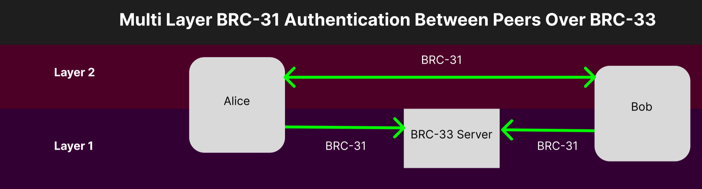

# BRC-33: PeerServ Message Relay Interface

Ty Everett (ty@projectbabbage.com)

## Abstract

This document introduces a message box architecture and relay interface to enable data exchange between two parties using a BRC-31 authenticated server. This system allows for message exchange and forwarding between parties who might be offline or unable to establish a direct peer-to-peer connection. While the use of a server as a go-between for peer-to-peer exchange is not novel, this system offers enough flexibility to support federation, removing the need for a single central server.

## Motivation

The Bitcoin whitepaper reveals that no existing mechanism allows payment exchange over a communication channel. Bitcoin addresses this issue by introducing a distributed timestamp server. However, obstacles such as NAT traversal issues and slow CGA adoption hinder the creation of channels for peer-to-peer general message exchange. The current internet infrastructure is not conducive to reliable peer-to-peer message exchange, lacking a proper mechanism for such exchanges between peers. This standard proposes a solution built on a BRC-31 authenticated server, which enables a simple message box architecture and relay system for peers who may not always be online.

## Specification

The system involves a sender, a recipient, and a server. The server enforces BRC-31 authentication and identifies all parties (senders and recipients) based on their identity keys. The server offers several interfaces to facilitate message delivery, receipt, and acknowledgment between the sender and recipient through various message boxes.

The server operates over HTTPS at an internet domain name and enforces BRC-31 authentication for all requests. It implements the following three endpoints:

### POST `/sendMessage`

Send a message to a recipient's message box.

#### Request Parameters

| Parameter       | Type   | Description                                        |
|-----------------|--------|----------------------------------------------------|
| `message`       | object | Message object containing all relevant information |
| `message.recipient` | string | The recipient's public key | Yes      |
| `message.messageBox` | string | The name of the recipient's message box |
| `message.body`  | string | The content of the message                         |

**Example Request:**

```json
{
  "message": {
    "recipient": "028d37b941208cd6b8a4c28288eda5f2f16c2b3ab0fcb6d13c18b47fe37b971fc1",
    "messageBox": "payment_inbox",
    "body": "hello"
  }
}
```

#### Response Parameters

Parameter	| Type   | Description
----------|--------|-----------------
`status`    |	string  | The status of the message sending operation

**Example Response:**

```json
{
  "status": "success"
}
```

### POST `/listMessages`

List messages from the specified message box.

#### Request Parameters

Parameter | Type | Description
----------|------|------------------
`messageBox` | string | The name of the message box to retrieve messages from

**Example Request:**

```json
{
  "messageBox": "payment_inbox"
}
```

#### Response Parameters

Parameter | Type | Description
----------|------|-----------------
`status` | string | The status of the message listing operation
`messages` | array | Array of message objects
`messages[].messageId` | integer | Unique identifier for the message
`messages[].body` | string | The content of the message
`messages[].sender` | string | The sender's public key

**Example Response:**

```json
{
  "status": "success",
  "messages": [
    {
      "messageId": 3301,
      "body": "hello",
      "sender": "028d37b941208cd6b8a4c28288eda5f2f16c2b3ab0fcb6d13c18b47fe37b971fc1"
    }
  ]
}
```

### POST `/acknowledgeMessage`

Acknowledge that a message has been received. After acknowledgment, the server deletes a message.

#### Request Parameters

Parameter | Type | Description
----------|------|------------------
`messageIds` | array | Array of message IDs to acknowledge

**Example Request:**

```json
{
  "messageIds": [
    3301
  ]
}
```

#### Response Parameters

Parameter | Type | Description
----------|------|------------------
`status`    | string | The status of the message acknowledgment operation

#### Example Response:

```json
{
  "status": "success"
}
```

### Message Authenticity and Digital Signatures

We leave it to higher-level protocols and systems to implement appropriate digital signature schemes and message authenticity checks for their relevant use-cases. Notably, all senders and all recipients use BRC-31 authentication to communicate with the server. The messages exchanged between the parties over the server could form a second-layer BRC-31 channel, between the two users themselves.



### Federation and Synchronization

BRC-34 and BRC-35 define the mechanism by which multiple servers can discover and route messages to one another, making use of an oerlay network. When properly implemented, this enables two parties to exchange messages with one another even when not using the same server.

### Monetization

We leave open the possibility for monetization by future specifications via BRC-41 when server operators relay or synchronize mesages. When implemented, BRC-41 acts as a drop-in replacement for BRC-31 and the server operators decide on a price. Participants choose which servers they are willing to pay to interact with.

## Limitations

This messaging system is not intended for long-term storage, but only for transport of messages. It should not be used, for example, to maintain a reliable list of all messages in a messaging application, only to facilitate the delivery of those messages to recipients. Once a recipient receives a message, they should generally store or act upon it in some way and then acknowledge it, removing it from the server.

## Implementations

The message relay architecture has been implemented in the [PeerServ API](https://peerserv.babbage.systems), created by the Babbage Team.