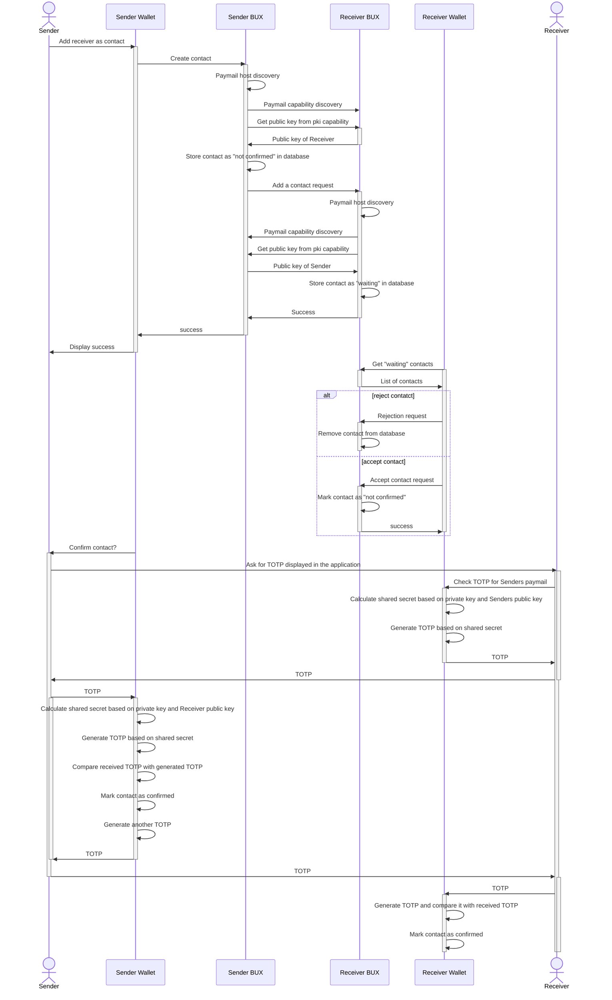

# BRC-77 Proven Identity Key Exchange (PIKE)

Darren Kellenschwiler (deggen@kschw.com)  
Damian Orzepowski (damian.orzepowski@4chain.studio)

## Abstract

TBD

## Motivation

TBD

## BRFCID

A random ID was generated in order to avoid label collisions in the capability document of a paymail server.

``` yaml
brfcid: 8c4ed5ef8ace
title: Proven Identity Key Exchange (PIKE)
author: Darren Kellenschwiler, Damian Orzepowski
version: 1.0.0
```

## Specification

TBD

## Implementations

TBD

## Flow


