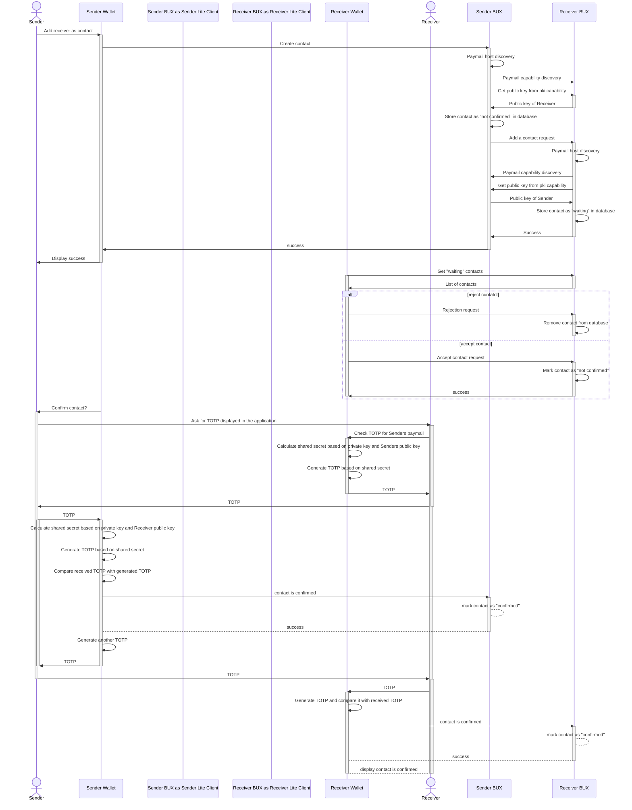
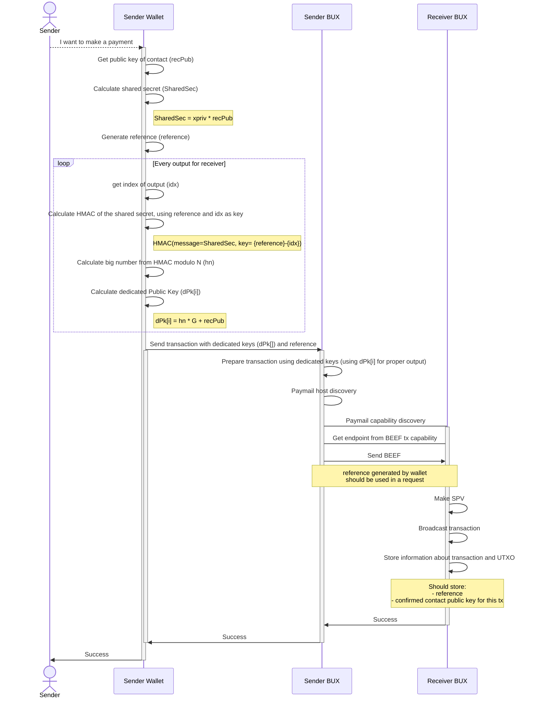
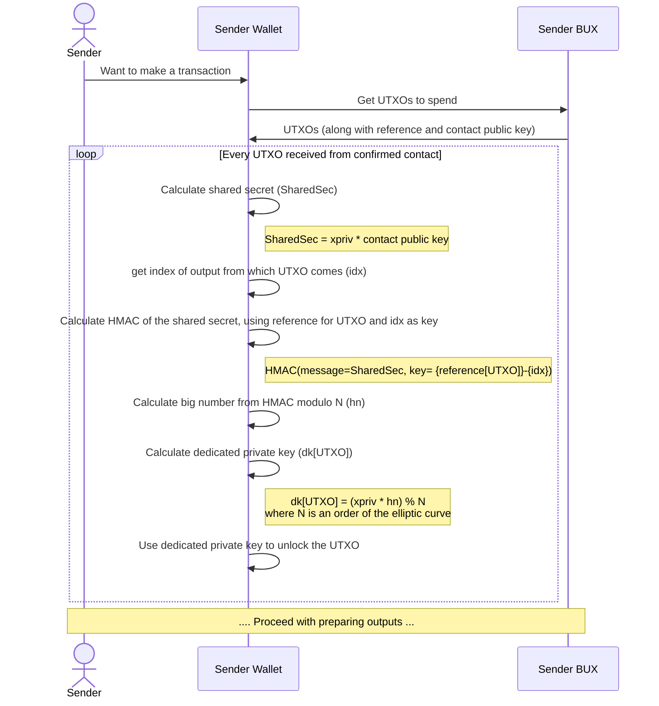

# BRC-77 Proven Identity Key Exchange (PIKE)

Darren Kellenschwiler (deggen@kschw.com)  
Damian Orzepowski (damian.orzepowski@4chain.studio)

## Abstract

TBD

## Motivation

TBD

## BRFCID

A random ID was generated in order to avoid label collisions in the capability document of a paymail server.

``` yaml
brfcid: 8c4ed5ef8ace
title: Proven Identity Key Exchange (PIKE)
author: Darren Kellenschwiler, Damian Orzepowski
version: 1.0.0
```

## Specification

TBD

## Implementations

TBD

## Flow

### Confirming contact

First the contact needs to be confirmed between counterparties.
We can leverage ["pki" Paymail capability](https://bsvalias.org/03-public-key-infrastructure.html) to get the counterparty master public key. 
And then we want to confirm that the master private key, 
from which master public key was derived, really belongs to the counterparty. 
Therefore, we can calculate a shared secret, and based on it, generate a TOTP codes on both sides. 
Then we can exchange them to confirm that public key really belongs to counterparty who is an owner of private key.

The detailed flow of confirming the contact is shown in the following sequence diagram:



### Making a payment

For making a payment we can leverage the ["BEEF Transaction" capability](../payments/0070.md).
Thanks to the confirmation of the counterparty public key and the ability to create a shared secret,
we are now able to create a new universe of addresses dedicated to the counterparty.
Therefore, we are able to omit usage of [paymentDestination capability](https://bsvalias.org/04-01-basic-address-resolution.html) 
or [P2P Payment Destination capability](../payments/0028.md).

To achieve high flexibility in generation of stable set of addresses we need to define the following values:
1. shared secret which is calculated by multiplying sender private key and a confirmed public key of the receiver
2. reference - a random (or at least unique in context of transactions for receiver) value used to reference the payment
3. idx - transaction output index for which he is calculating an address

The detailed flow of making the payment for the confirmed contact is shown in the following sequence diagram:



### Spending UTXO

When the Sender want to make transaction spending the UTXO from the transaction made by confirmed contact 
(so the outputs made to address based on dedicated public key), Sender needs to derive a new dedicated private key.

To unlock the UTXO locked by a P2PKH script, Sender needs a private key to prepare signature. 
The process of preparing such a private key is presented in the diagram below.


