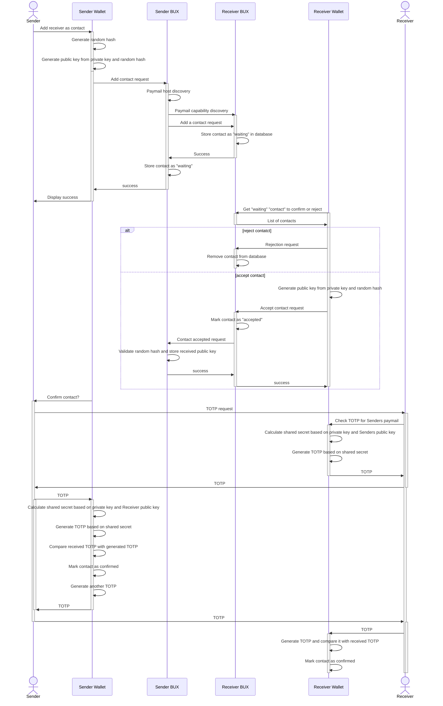

# BRC-77 Proven Identity Key Exchange (PIKE)

Darren Kellenschwiler (deggen@kschw.com)  
Damian Orzepowski (damian.orzepowski@4chain.studio)

## Abstract

Allowing humans to securely exchange public keys using web apis and an off channel sharing of TOTPs.

## Motivation

When you use hosted servers for payment output generation there's no way to detect if the host has been compromised and is sharing keys not associated with the intended recipient.

## BRFCID

A random ID was generated in order to avoid label collisions in the capability document of a paymail server.

``` yaml
brfcid: 8c4ed5ef8ace
title: Proven Identity Key Exchange (PIKE)
author: Darren Kellenschwiler, Damian Orzepowski
version: 1.0.0
```

## Specification

Roughly speaking you create a shared secret between you and the counterparty using their public key and your private key. If you each do this you can arrive at a shared secret. You then derive a time hashed one time pass code to prove you both have the same value - each sharing the TOTP and validating the counterparty's. Thereafter you can use that public key knowing that it really is that counterparty without fear of MITM attacks. 

## Implementations

[SPV Wallet](https://github.com/bitcoin-sv/spv-wallet)

## Flow

1. Sender wallet: generate random hash
2. Sender wallet generate public key from private key and random hash
3. Sender wallet is sending "add contact request" to Sender BUX containing:
   a. contact paymail address
   b. random hash
   c. generated public key
4. Sender BUX is performing Paymail host discovery (which is described on this page: https://tsc.bsvblockchain.org/standards/paymail/#ServiceDiscovery)
5. Sender BUX is performing Paymail capability discovery on Receiver BUX by requesting /.well-known/bsvalias
6. If Receiver BUX doesn't contain Proven Identity Key Exchange (PIKE) capability, Sender BUX should return an error to Sender Wallet
7. else the Sender BUX is sending a "Add a contact" request to Receiver BUX on the endpoint provided in PIKE capability. This request contains:
   a. sender paymail address
   b. random hash
   c. generated public key
8. Receiver BUX stores that "contact" as "waiting" in database
9. Receiver BUX is answering to Sender BUX with success
10. Sender BUX is storing the "contact" as "waiting"
11. Receiver Wallet asks Receiver BUX for "waiting" "contact" to confirm or reject
12. Receiver BUX is responding with the list of contacts
13. If Receiver Wallet reject the contact, then:
    a. it is sending rejection request to Receiver BUX
    b. Receiver BUX is removing the contact from database
    c. In that case the flow ends
14. else: Receiver Wallet generate public key from private key and random hash from the contact
15. Receiver Wallet is sending the request for Receiver BUX for accepting the contact with informations:
    a. paymail address for contact to accept
    b. generated public key
16. Receiver BUX is marking a "contact" as "accepted"
17. Receiver BUX is sending the "contact accepted" request to Sender BUX with:
    a. paymail address of Receiver
    b. generated public key
    c. random hash
18. Sender BUX is validating random hash, and stores received public key in "contact" and marks it as accepted
19. Sender Wallet is asking Sender to confirm contact
20. Sender asks Receiver for TOTP
21. Receiver checks TOTP for Senders paymail in Receiver Wallet
22. Receiver Wallet calculates shared secret based on private key and Senders public key
23. Receiver Wallet generates TOTP based on shared secret
24. Receiver Wallet sends back TOTP to Receiver
25. Receiver is responding with TOTP to Sender
26. Sender is providing TOTP to Sender Wallet
27. Sender Wallet calculates shared secret based on private key and Receiver public key
28. Sender Wallet generates TOTP based on shared secret
29. Sender Wallet is comparing received TOTP with generated TOTP. If their match then it marks contact as confirmed.
30. Sender Wallet is now generating another TOTP and provides to Sender
31. Sender is providing TOTP to Receiver
32. Receiver is providing TOTP to Receiver Wallet
33. Receiver Wallet is generating TOTP and comparing it with received TOTP If their match then it marks contact as confirmed.


