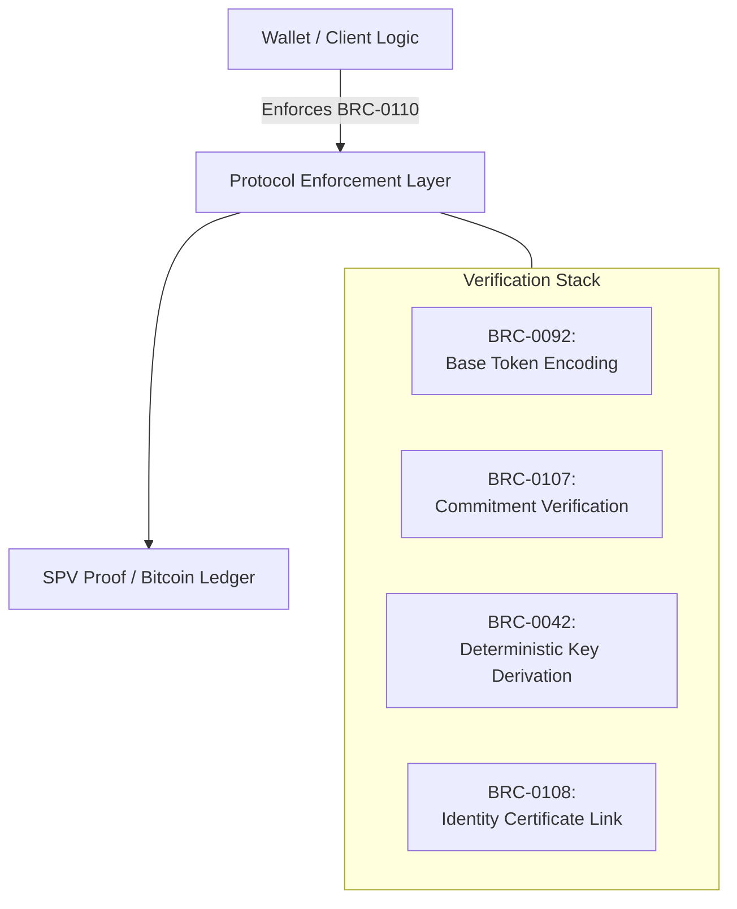
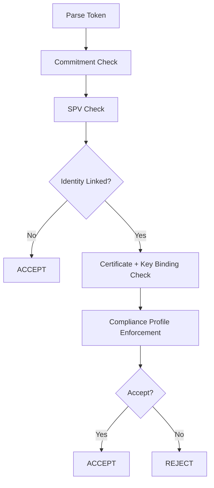

# BRC-0110: Identity-Linked Deterministic Token Verification Framework

**Author:**  
Jake Jones (<jake.jones@bsvassociation.org>)

**Status:** Draft  
**Version:** 1.0  

**Required Dependencies:**  
- BRC-0042 (Deterministic Key Derivation)  
- BRC-0092 (Mandala Token Protocol)  
- BRC-0107 (Commitment-Based Token Integrity)  
- BRC-0108 (Identity-Linked Token Metadata)

**Optional Dependencies:**  
- BRC-0043 (Purpose Identifiers)  
- BRC-0067 (SPV Packaging Format)

---

## Abstract

BRC-0110 defines a deterministic, SPV-verifiable framework for identity-linked token transfers on Bitcoin SV. It specifies how wallets verify compliance requirements using BRC-0042 key derivation, BRC-0107 commitments, and BRC-0108 identity bindings — without relying on overlay networks or external validators.

This standard ensures identity-restricted token transfers remain interoperable, decentralized, portable, and enforceable while enabling selective privacy, regulatory compliance, and recovery options within the original peer-to-peer Bitcoin model.

---

## Motivation

Existing BSV token standards provide token encoding (BRC-0092), verifiable state transitions (BRC-0107), and identity metadata (BRC-0108). However, none define:

- How identity-based constraints are enforced  
- How signatures bind identities to transaction lineage  
- How SPV wallets validate compliance without a trusted intermediary  
- How field-level revelation is performed and verified consistently  

BRC-0110 introduces a unifying rule set that makes identity-restricted token usage deterministic, verifiable, and portable between software implementations.

---

## Architecture Overview

---

## Terminology

| Term | Definition |
|------|-----------|
| **Identity-Linked Token (ILT)** | A token output containing a valid BRC-0108 certificate hash. |
| **Compliance Profile** | A structured set of rules defining identity requirements for token usage. |
| **Derivation Scope** | The deterministic key domain created using BRC-0042. |
| **Selective Revelation Bundle** | A minimally sufficient encrypted proof package revealing only required certificate fields. |
| **SPV Proof Package** | A format containing transaction data plus Merkle proof (optionally BRC-0067-formatted). |

---

## Normative Rules

### 1. Identity Binding

A token SHALL be treated as identity-linked if:

1. The token output contains a BRC-0108 certificate hash, AND  
2. The spending signature is produced using a key derived per BRC-0042 from the certificate root.

If either condition is not met, BRC-0110 SHALL NOT apply.

### 2. Deterministic Key Derivation

All operational keys MUST be derived using:

`BRC-0042(master_certificate_entropy, assetId, purposeId)`

Use of BIP-32, SLIP-10, hardened derivation paths, or external hierarchical schemes is **NOT permitted.**

### 3. Signature Requirements

Identity-linked token transfers MUST be signed using:

`SIGHASH_SINGLE | SIGHASH_ANYONECANPAY`

Exceptions are permitted ONLY in:

- Custodial batch aggregation  
- Minting  
- Time-locked recovery workflows  

Such exceptions MUST be explicitly signaled using BRC metadata.

### 4. Protocol Signaling

BRC-0110 shall activate under a **hybrid signaling model**:

- **Implicit activation:** Any transaction using identity metadata (BRC-0108) and BRC-0042-derived signatures SHALL be treated as BRC-0110-compliant.  
- **Explicit activation (optional):** A protocol identifier MAY appear in metadata (e.g., `0110`, `0110.1`) for version governance.  

Explicit signaling supersedes implicit interpretation.

### 5. Mandatory Verification Flow

A compliant verifying wallet MUST validate in the following order:

1. Token encoding validity (BRC-0092)

2. Commitment integrity (BRC-0107)

3. SPV validity (Merkle proof)

4. Identity certificate presence & authenticity (BRC-0108)

5. Deterministic derivation match (BRC-0042)

6. Compliance profile evaluation (rules + selective revelation)

Failure at any stage **MUST** reject the transfer.

---

## Compliance Profiles

| Profile | Required Identity Level | Typical Use |
|---------|-------------------------|-------------|
| **Open** | None | Standard fungible tokens |
| **Identity-Present** | Certificate exists | Membership, access tokens |
| **Restricted** | Field-level selective revelation | Age verification, region gating |
| **Regulated** | Certificate type + rules | Securities and compliance tokens |
| **Recovery-Capable** | Secondary derivation | Lost-key account recovery |

---

## Verification Process

---

## Reference Implementation Guidance (Non-Normative)

Developers SHOULD:

- Cache certificates to avoid repeated revelation requests  
- Use temporary encryption keys for field-level exchanges  
- Display meaningful compliance failure messages to improve UX  
- Support offline verification when proof bundles are present  

---

## Test Vectors

### Vector 1 — Valid Identity-Linked Transfer  
**Expected Result:** Accept

### Vector 2 — Invalid Key Derivation  
**Expected Result:** Reject

### Vector 3 — Identity Valid, Compliance Failed (e.g., age restriction)  
**Expected Result:** Reject

Additional machine-readable vectors SHALL accompany the reference implementation.

---

## Backward Compatibility

| Case | Result |
|------|--------|
| Non-identity tokens | Unaffected |
| Legacy wallets | MAY ignore identity fields |
| Identity-linked tokens spent without proper key derivation | MUST reject |

---

## Security Considerations

- Commitment chaining prevents replay attacks  
- SPV trust model maintained; no overlay dependency  
- Selective revelation prevents unnecessary personal data exposure  
- Recovery derivation prevents permanent loss without custodianship  
- Prohibition of non-BRC-0042 HD schemes prevents fragmentation  

---

## References

- BRC-0042: Deterministic Key Derivation  
- BRC-0092: Mandala Token Protocol  
- BRC-0107: Commitment-Based Token Integrity  
- BRC-0108: Identity-Linked Token Metadata  
- BRC-0067: (Optional) SPV Packaging Format
