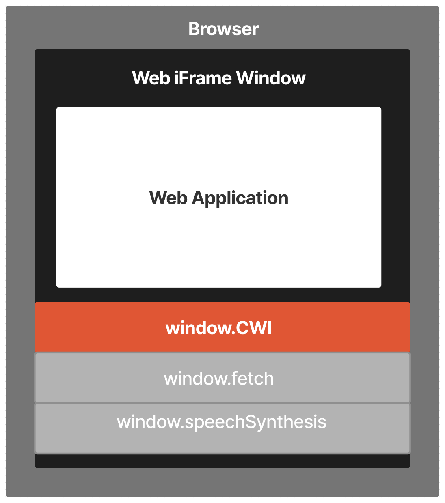

# BRC-7: Window Wallet Communication Substrate

Brayden Langley (brayden@projectbabbage.com)

## Abstract

The Window Wallet Communication Substrate is a standardized interface that enables seamless integration between web applications and browser embedded Bitcoin wallets. It serves as a unified gateway for applications to access various wallet functionalities, including the creation of Bitcoin transactions, encryption, digital signature creation, and more. By establishing this standardized interface, applications gain the ability to support multiple wallet providers, enhancing flexibility and choice for users in managing their Bitcoin-related tasks. This interface empowers users with greater control and accessibility while maintaining compatibility across different applications and wallets.

## Motivation

The motivation behind this standard is to enable web browsers to directly integrate Bitcoin wallet functionality without relying on an additional application running on the client's device.

Although [BRC-5](../wallet/0005.md) defines a standard for local communication over HTTP, integrating wallet functionality in the browser eliminates the need for external wallet applications, reducing the overhead of inter-process communication and network requests.

This also eliminates the need for users to switch between multiple applications when approving permissions, creating transactions, etc. They can perform all wallet-related tasks within the web application they are already using, resulting in a more cohesive and convenient user experience.

## Specification

We define a specification for providing access to Bitcoin wallet functionality via the global window object that is directly available in all standard browser implementations.

Once the browser has verified that the user is authenticated, an object labeled `CWI` should be added to the window object to provide access to the standard wallet functionality as defined by [BRC-56](../wallet/0056.md).


### Standard CWI Functions Associated with Various Message Types

For each of the message pairs (request and response) incorporated into [BRC-56](../wallet/0056.md), we specify the existence of a corresponding message type with a specific function name:

Message Type                      | Window Function Name Value
----------------------------------|---------------------------
[BRC-1 Transaction Creation](../wallet/0001.md/#transaction-creation-request)        | `window.CWI.createAction()`
[BRC-2 Encryption](../wallet/0002.md/#encryption-request)                  | `window.CWI.encrypt()`
[BRC-2 Decryption](../wallet/0002.md/#decryption-request)                  | `window.CWI.decrypt()`
[BRC-3 Signature Creation](../wallet/0003.md/#signature-creation-request)          | `window.CWI.createSignature()`
[BRC-3 Signature Verification](../wallet/0003.md/#signature-verification-request)      | `window.CWI.verifySignature()`
[BRC-53 Certificate Creation](../wallet/0053.md/#certificate-creation-request)       | `window.CWI.createCertificate()`
[BRC-53 Certificate Verification](../wallet/0053.md/#certificate-proof-request)   | `window.CWI.proveCertificate()`
[BRC-56 HMAC Creation](../wallet/0056.md/#hmac-creation-request)              | `window.CWI.createHmac()`
[BRC-56 HMAC Verification](../wallet/0056.md/#hmac-verification-request)          | `window.CWI.verifyHmac()`
[BRC-56 Public Key Derivation](../wallet/0056.md/#public-key-request)      | `window.CWI.getPublicKey()`
[BRC-56 Certificate List](../wallet/0056.md/#certificate-list-request)           | `window.CWI.findCertificates`
[BRC-56 Version Request](../wallet/0056.md/#client-version-request)            | `window.CWI.getVersion()`
[BRC-56 Network Request](../wallet/0056.md/#bitcoin-network-request)            | `window.CWI.getNetwork()`
[BRC-56 Authentication Request](../wallet/0056.md/#authentication-status-request)     | `window.CWI.isAuthenticated()`
[BRC-56 Async Auth Request](../wallet/0056.md/#asynchronous-authentication-request)         | `window.CWI.waitForAuthentication()`

This will allow applications to call functions with the following syntax:

```javascript
window.CWI.<functionName>
```

### Parameter Format Specification

We specify that all *required* parameters are provided in an object to the CWI functions. 

**Example Identity Key Request**
```javascript
const identityKey = await window.CWI.getPublicKey({ 
    identityKey: true 
})
```

**Example Encrypt Function**
```javascript
const ciphertext = await window.CWI.encrypt({
  plaintext: Buffer.from('Hello BRCs!'),
  protocolID: [0, 'Hello World'],
  keyID: '1'
})
```

## Implementation

Implementors of this BRC should follow the abstract messaging layer as defined by [BRC-56](../wallet/0056.md) to provide support for standard messaging types, and then modify the window object created to include this functionality in a CWI object.



